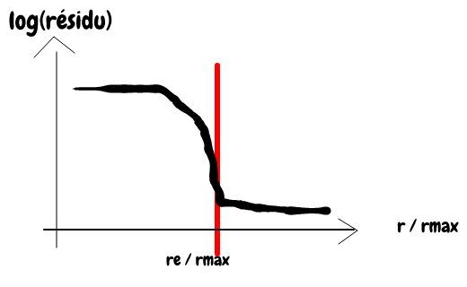
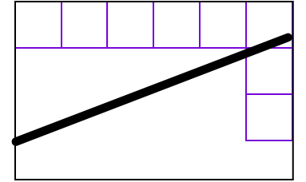

---
export_on_save:
  markdown: false
---

# Résolution effective d'une image

Projet dans le cadre du cours d'imagerie sous-pixellique

Encadrant : `Lionel Moisan` à Paris Descartes - Site saint Germain

## lundi 3 décembre 2017

Choix du sujet (numéro 1)
Enoncé du sujet initial :

_La résolution nominale (nombre de pixels) d'une image peut, pour des raisons diverses, ne pas correspondre à l'information effectivement présente dans l'image. On se trouve alors dans une situation de sur-échantillonnage où, au bruit près, les hautes fréquences du spectre n'apportent aucune information. Une façon simple de réaliser ce phénomène est de réduire une image par coupure fréquentielle, puis de la rezoomer à la résolution initiale par zero-padding: si l'on obtient ainsi une image indiscernable de l'image originale, cela prouve bien que la résolution effective de l'image est inférieure à sa résolution nominale. On proposera une ou plusieurs solutions pour tenter de mesurer la résolution effective d'une image, avec une validation sur données simulées et données réelles._

Recherche de mots clés sur des articles traitant du sujeet :
+ _actual resolution_ - pas de résultats
+ _effective resolution_ - pas de résultats

## jeudi 7 décembre 2017

Premières pistes données par M. Moisan :
### Définir un cadre précis.
Dans un premier temps, définir ce qu'on entend par réslution effective d'une image.
1. Se dire qu'une image sous-résolue présente un spectre dont les hautes fréquence sont principalement du bruit, et qu'on gagnerait donc en résolution si on les coupait.
+ Partir du fait qu'un bruit blanc gaussien `pur` a une résolution nulle, même si dans le cadre de la théorie de l'information, au contraire, sa résolution n'est pas nulle (puisque si on transmet des choses cohérentes entre-elles, on peut optimiser la transmission en ne conservant que les parties incohérentes)
+ Définir des opérations simples ne changeant pas la résolution effective d'une image. Par exemple, le zoom par zéro padding avec rajout de bruit sur les hautes fréquences ne change pas la résolution effective (suivant notre définition)
+ Construire une base d'images réelles ou de synthèse dont on considère connaître la résolution (c'est-à-dire donc le spectre de Fourier est jugé suffisamment rempli)
+ Si on prend une image, qu'on randomise sa phase, trouver des statistiques d'évaluation du résultat obtenu. Si le résultat obtenu contient appproximativement la même information, on peut alors considérer que la résolution de l'image considérée n'est pas la résolution nominale. (Même concept possible en randomisant le module ?).
+ Question substencielle : qu'est-ce qu'un bruit blanc.

### Objectif (modulable) déterminer quelle est la résolution effective d'une image

## mardi 23 janvie 2018
(Premier point sur le projet)

Il a été rappelé que le but du projet n'était pas forcément d'aboutir à une méthode satisfaisante ni complète pour déterminer la résolution d'une image, mais bien la démarche et l'approfondissement de la méthode choisie.

1. On peut commencer par définir de façon triviale la résolution d'une image comme étant le plus petit rectangle contenant tout le spectre de Fourier de l'image originale. C'est _stable_ par zoom par zéro-padding, mais le bruit blanc gaussien n'aurait pas une résolution nulle.
2. On modélise le bruit additif gaussien : $u = \tilde{u} + n$, et on prend la transformée de Fourier. Le bruit étant additif, les coefficients de Fourier de $u$ sont la somme de la contribution des coefficients de Fourier de $v$, l'image débruitée et de $n$, du bruit. Chaque composant de $\mathcal{F}(v)$ va alors être bruitée par une variable gaussienne.
    + Considérant le résidu $$\int_{\Omega \setminus \Omega_r} \left|\mathcal{F}(\tilde{u})\right|^2 $$ on s'intéroge sur la forme du résidu en fonction du _rayon_. On peut espérer que si on a une forme semblable à celle-ci, on puisse déterminer $r_e$ comme la distance du rectangle déterminant la résolution effective de l'image.
    
    + Si on suppose que $\mathcal{F}(\tilde{u})$ a pour support $\Omega_0$ alors en probabilité :
    $$ \mathbb{E}\left[\int_{\Omega \setminus \Omega_r}\left|\mathcal{F}(\tilde{u})\right|^2\right] \sim \chi^2$$
    + Pour tester ces hypothèses, on peut procéder à la synthèse d'une image _bon candidat_ comme suit :
      + image sur-échantillonnée
      + noyau de diffraction (plus petit que $f_c$) (convolution)
      + bruit
    + `Il subsiste toujours le risque de se tromper sur la variance du bruit` ?
3. On risque cependant de ne pas être en mesure de déterminer la résolution d'images présentant ce type de spectre :

On est surement amené à reconsidéré l'idée de résidu en découpant l'intégrale sur des petits carrés ?

__Quelques idées en vrac__ :
1. Si on prend un bruit blanc, qu'on calcule sa transformée de Fourier qui est à symétrie hermitienne, que l'on ne considère que le plan supérieur, on a une collection de variables aléatoire supposées indépendantes (car la transformée de Fourier d'un bruit blanc reste un bruit blanc). On peut alors calculer la matrice de covariance qui est diagonale, sauf pour quelques variables sous contraintes (comme (0,0) : moyenne de l'image dont la variance de la partie imaginaire est nulle, et sur les bords ?)
2. Qu'est-ce que la résolution effective dans le cas d'une image aliasée ? e.g. GPC (Global Phase Coherence) qui chute brutalement. Est-ce que ma résolution effective chute aussi brutalement ?
3. Question plus dure : si on s'amuse à dézoomer par interpolation bilinaire en passant de (1000x1000) à (2000x2000), qu'advient-il de la résolution effective ? On peut regarder les lignes de niveaux de l'image, mais ça nous emmène complétement dans une autre direction

__D'aures pistes possibles__ :
1. On peut regarder l'histogramme du gradient, et les statistiques dessus (statistiques naturelles, cf articles de Simoncelli, Munford)
2. Le calul de la résolution effective peut permettre de mesurer la limite de diffraction d'un instrument (en se ramenant au problème du calcul de résidu pour déterminer le niveau de bruit / le noyau de diffraction ?)
3. Cohérence de phase : si on randomise la phase d'un bruit blanc, la TV ne change pas.
